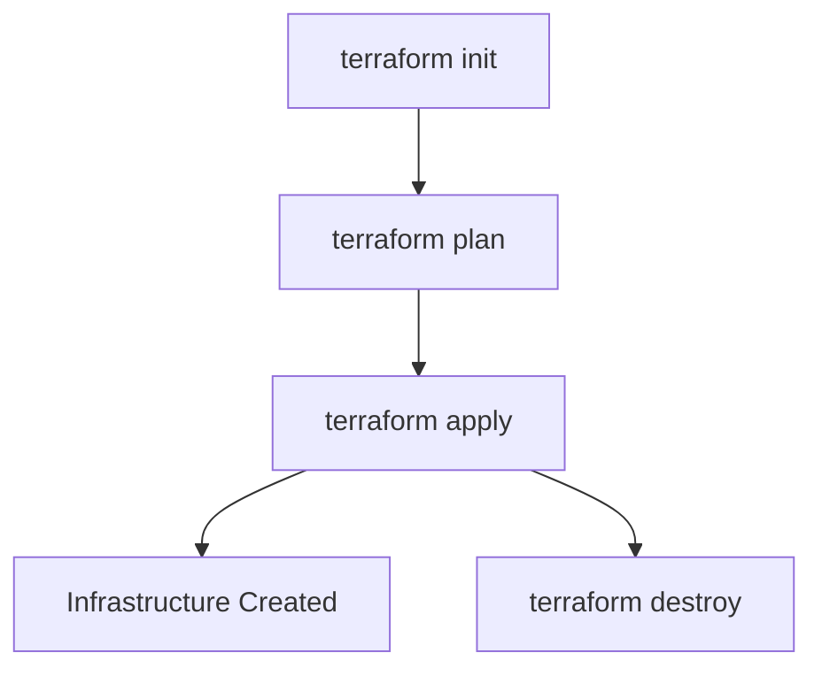

<h1 align="center">🚀 Terraform Quickstart Guide</h1>
<p align="center">Your Infrastructure as Code cheatbook 💻🌍</p>

---

## 🌱 What is Terraform?

Terraform helps you manage cloud infrastructure using code (IaC).  
It's like writing a recipe 🍽️ — and Terraform is the chef 👨‍🍳 that prepares your cloud kitchen.

---

## 🔧 How Terraform Works



---

## 🧠 Core Concepts (Visual Summary)

| 🌟 Feature       | 🔍 Description |
|------------------|----------------|
| 🔌 **Provider**  | Cloud plugin (AWS, GCP, Azure, etc.) |
| 🏗️ **Resource**  | Component like EC2, S3, IAM |
| 🧮 **Variable**  | Input values for customization |
| 📤 **Output**    | Return useful info (e.g. IP address) |
| 🗃️ **State**     | Tracks what's been created |
| 🔁 **Module**    | Reusable config chunks |
| 🔧 **Provisioner** | Run scripts or commands after setup |

---

## 🛠️ Project Structure (as Folders)

```text
terraform-project/
├── main.tf              # Main config
├── variables.tf         # Input variables
├── outputs.tf           # Output values
├── terraform.tfvars     # Variable values
├── .gitignore           # Ignore sensitive files
```

---

## 📄 Local File Example

```hcl
resource "local_file" "myfile" {
  filename = var.filename
  content  = var.content
}
```

```hcl
variable "filename" { default = "output.txt" }
variable "content"  { default = "Hello Terraform!" }
```

---

## 🌍 AWS Example - IAM User

```hcl
provider "aws" {
  region = "us-west-2"
}

resource "aws_iam_user" "admin" {
  name = "YogiAdmin"
  tags = {
    Role = "DevOps"
  }
}
```

---

## ☁️ Remote State (S3 + DynamoDB)

```hcl
terraform {
  backend "s3" {
    bucket         = "your-bucket-name"
    key            = "terraform.tfstate"
    region         = "us-west-2"
    dynamodb_table = "terraform-lock"
  }
}
```

✅ Keeps state file secure, consistent, and shareable.

---

## 📊 Terraform Command Summary

| 🔧 Command             | 💡 What It Does |
|------------------------|----------------|
| `terraform init`       | Initializes the project |
| `terraform plan`       | Previews what changes will be made |
| `terraform apply`      | Applies the config (creates infra) |
| `terraform destroy`    | Destroys all created infra |
| `terraform fmt`        | Formats Terraform files |
| `terraform validate`   | Checks for syntax errors |

---

## 🚀 GitHub Upload

```bash
git init
git add .
git commit -m "Initial commit"
git branch -M main
git remote add origin https://github.com/YOUR_USERNAME/YOUR_REPO.git
git push -u origin main
```

---

## 🔒 .gitignore (Important!)

```bash
.terraform/
*.tfstate
*.tfstate.backup
terraform.tfvars
```

🙅 Never upload secrets or state files to GitHub!

---

## 🧠 Pro Tip

Use **`terraform output`** to view output values like public IPs, usernames, and file paths post-deployment.

---

## 📚 Helpful Links

- 📘 [Terraform Official Docs](https://developer.hashicorp.com/terraform/docs)
- 🌐 [AWS Provider Docs](https://registry.terraform.io/providers/hashicorp/aws/latest)

---

<h3 align="center">Made with ☕ and 💻 by Yogi</h3>
